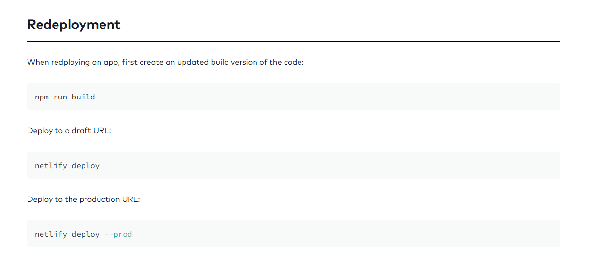

https://676326f6b16ae3628e5b7819--martingrennanncnews.netlify.app/articles
https://676326f6b16ae3628e5b7819--martingrennanncnews.netlify.app/

A link to the deployed version.
General info about your app, a brief description of what the project is, and how to use your app.
A link to your back end repo.
The minimum version of Node required to run locally. You can check your Node version using node --version in your terminal.
Clear instructions on how to run your project locally, e.g. git clone <repo-url>, cd..., etc.

This portfolio project was created as part of a Digital Skills Bootcamp in Software Engineering provided by [Northcoders](https://northcoders.com/)